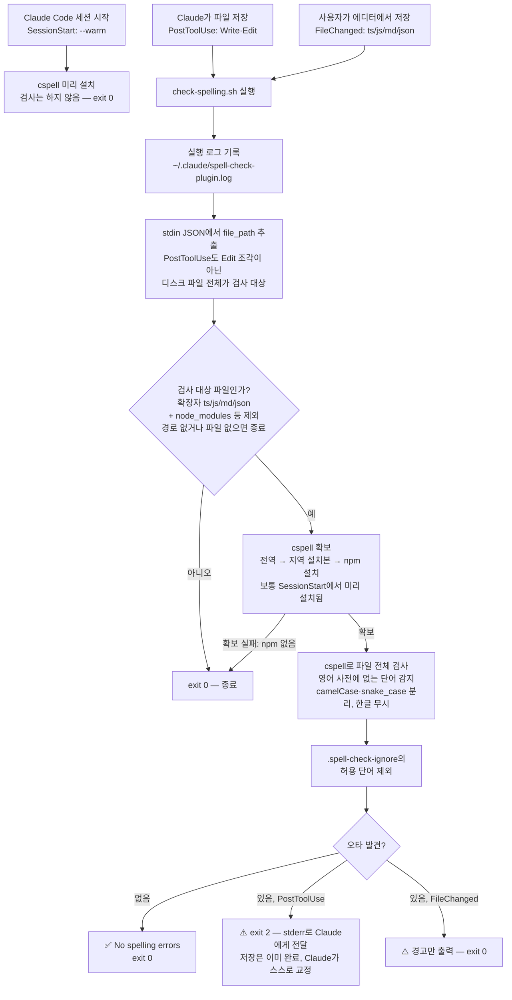

# spell-check 플러그인

Claude Code에서 소스 코드의 **영어 철자 오류**(식별자, 상수 키, 문자열, 주석)를 자동으로 검사하는 플러그인입니다.

VSCode 확장프로그램을 대체하며, Claude의 언어 모델 능력을 활용해 더 정교한 검사를 제공합니다.

## 기능

### 자동 검사 (Hook)
- **파일 저장 시 자동 실행**: 파일 전체 소스(코드, 문자열, 주석, 문서)에서 오타 감지
- **비침투적**: 저장이 끝난 뒤 검사하므로 절대 저장을 막지 않음 — 오타는 Claude에게 피드백되어 자동 교정
- **빠른 피드백**: 저장 직후 터미널에 결과 표시

### 수동 검사 (Skill)
```bash
/spell-check                    # 현재 파일 검사
/spell-check --dir docs         # 특정 디렉토리 검사
/spell-check --fix              # 대화형 수정 제안
```

### 팀 커스터마이제이션
- `.spell-check-ignore`: 허용할 단어 목록 (회사명, 기술약자, 팀 고유 용어 — 한 줄에 한 단어)
- 프로젝트별 설정 가능

---

## 설치

### 로컬 개발 테스트
```bash
# 플러그인 디렉토리에서
claude --plugin-dir .

# Claude Code 시작 후
/spell-check
```

### 개인 설치 (팀원용, 가장 간단)
Claude Code 안에서:
```
/plugin marketplace add simjieun/spell-check-plugin
/plugin install spell-check@team-tools
```

### 팀 프로젝트에 추가 (프로젝트 단위 자동 적용)
프로젝트 루트의 `.claude/settings.json`에 아래를 추가하면, 팀원이 해당 프로젝트에서 Claude Code를 열 때 자동으로 설치를 제안받습니다:
```json
{
  "extraKnownMarketplaces": {
    "team-tools": {
      "source": {
        "source": "github",
        "repo": "simjieun/spell-check-plugin"
      }
    }
  },
  "enabledPlugins": {
    "spell-check@team-tools": true
  }
}
```

---

## 사용 예시

### 1. 자동 검사 (파일 저장 시)
```
파일을 저장하면 자동으로:

🔍 Checking spelling in: src/api.ts
  Line 12: 'recieve' → should be 'receive'
  Line 45: 'occured' → should be 'occurred'
⚠️  Found 2 potential spelling issues
```

### 2. 수동 검사 & 수정
```
/spell-check --fix

Claude가 제안하는 수정:
✅ src/api.ts
   - Line 12: recieve → receive
   - Line 45: occured → occurred

Apply changes? (y/n): y
```

### 3. 허용 단어 추가
오탐지된 단어는 `.spell-check-ignore`에 한 줄씩 추가하면 다시 잡지 않습니다 (형식은 파일 상단 주석 참고).
목록은 이 repo에서 팀 공통으로 관리하므로, **단어 추가는 이 repo에 PR로 올려주세요** —
각자 설치된 플러그인의 파일을 직접 고치면 본인에게만 반영되고 업데이트 시 덮어써집니다.

---

## 동작 순서도 (Hook 자동 검사)

검사는 항상 **저장이 끝난 뒤** 실행됩니다 — 오타가 있어도 저장을 막지 않습니다.



---

## 검사 엔진 (cspell)

전체 영어 사전 기반의 [cspell](https://cspell.org)을 사용합니다. 전역 cspell이 없으면 **세션 시작 시(SessionStart hook)** npm으로 플러그인 디렉토리에 미리 자동 설치됩니다 (Node 18+, 전역 오염 없음) — 첫 저장 검사가 느려지지 않습니다. 설치 전에 검사가 먼저 실행되면 그 시점에 설치하고, npm이 없는 환경에서는 검사를 건너뜁니다.

- **임의의 오타 감지**: 알려진 오타 목록이 아니라 사전에 없는 모든 단어를 감지 (discoint, modifed, recieve 등)
- **식별자 내부 오타**: camelCase/snake_case 분리 내장 (getSeperator → Seperator 감지)
- **한글 무시**: 한글 주석·문자열은 검사하지 않음
- **오탐 관리**: 도메인 단어(제품명·약어 등)가 오탐되면 `.spell-check-ignore`에 추가

### Claude 모델 활용 (더 정교함)
- **대소문자 일관성**: ModifiedDate vs modifiedDate 혼용 감지
- **표기 일관성**: dataBase vs database 혼용 감지

---

## 설정

### 플러그인 비활성화
```bash
/plugin disable spell-check@team-tools
```

---

## VSCode 확장과의 차이

| 기능 | VSCode 확장 | spell-check 플러그인 |
|------|-----------|------------------|
| 자동 검사 | UI 표시 | 터미널 출력 + 수정 제안 |
| 문맥 이해 | 패턴 기반 | Claude 모델 활용 |
| 팀 설정 | 전역만 | 프로젝트별 가능 |
| AI 수정 제안 | 없음 | 있음 (대화형) |

---

## 문제 해결

### Hook이 실제로 실행됐는지 확인
hook이 트리거될 때마다 실행 로그가 남습니다:
```bash
tail -f ~/.claude/spell-check-plugin.log
# 2026-07-02 14:30:12 [PostToolUse] src/api.ts
# 2026-07-02 14:31:05 [FileChanged] src/constants.ts
```
경로를 바꾸려면 `SPELL_CHECK_LOG_FILE` 환경 변수를 설정하세요.

### Hook이 실행되지 않음
```bash
# Hook 파일 권한 확인
chmod +x scripts/check-spelling.sh

# 플러그인 재로드
/reload-plugins
```

### 오탐지가 많음
- `.spell-check-ignore`에 단어를 추가하는 PR을 이 repo에 올려주세요

---

## 라이선스

MIT

## 기여

PR 환영합니다! 팀 피드백은 저희 로드맵을 결정합니다.

스크립트를 수정했다면 PR 전에 테스트를 돌려주세요:
```bash
node tests/check-spelling.test.js
```
